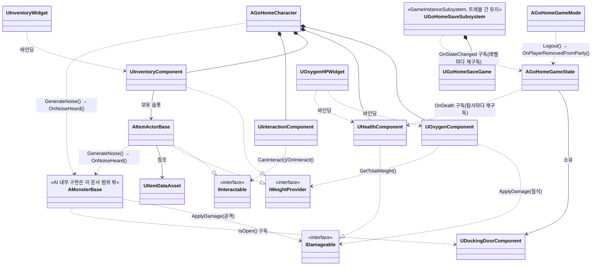

# GoHome 기술 아키텍처 (개발용)

> 이 문서는 개발자용 문서군(`Docs/Dev/`)이다. 링크 검증은 아래 "Docs/Design 참조 점검 체크리스트" 절 참고.
>
> 이 문서의 역할은 [../Design/02_GoHome_기술분석서.md](../Design/02_GoHome_기술분석서.md)에 이미 확정된 시스템 스펙을 실제 `Source/GoHome/` 폴더·클래스 이름에 매핑하고, 그 클래스들이 서로 어떤 관계·인터페이스로 맞물리는지 확정하는 것이다. **인일/복잡도/담당자 수치는 이 문서에 옮겨 적지 않는다** — 유일한 출처는 02문서이므로 필요하면 그쪽을 열어서 확인할 것. 반대로 **클래스 관계·경계 인터페이스 시그니처(아래 "시스템별 클래스 관계", "시스템 간 인터페이스 계약" 두 절)는 이 문서가 유일한 출처**다 — 02문서에는 시그니처 수준 내용이 없다.
>
> AI(`Source/GoHome/AI/`)의 내부 구현(상태 머신, 조향 로직 등)은 팀원 작업에 따라 바뀔 수 있으므로 이 문서에서 다루지 않는다. AI는 다른 시스템과 맞닿는 **경계 인터페이스**(데미지 전달, 소음 감지, 도킹 문 상태 구독)만 이 문서에서 고정한다 — 이 경계만 지키면 AI 내부 구현이 바뀌어도 다른 시스템은 영향받지 않는다.

## 목차

- [Docs/Design 참조 점검 체크리스트](#docsdesign-참조-점검-체크리스트)
- [모듈/폴더 구조](#모듈폴더-구조)
- [시스템 → 클래스 매핑](#시스템--클래스-매핑)
- [시스템별 클래스 관계](#시스템별-클래스-관계)
- [시스템 간 인터페이스 계약](#시스템-간-인터페이스-계약)
- [병렬 착수를 위한 헤더 스텁과 소유권](#병렬-착수를-위한-헤더-스텁과-소유권)
- [클래스 다이어그램](#클래스-다이어그램)
- [의존성/착수 순서](#의존성착수-순서)
- [2차 프로토타입 추가 시스템 배치](#2차-프로토타입-추가-시스템-배치)
- [Replication 권한 원칙](#replication-권한-원칙)

## Docs/Design 참조 점검 체크리스트

스크립트 동작 방식은 저장소 루트 [CLAUDE.md](../../CLAUDE.md) "검증 스크립트" 절 참고. 스크립트가 못 잡는 부분(본문 텍스트로만 언급된 절 번호)이 있으니, `Docs/Design/01`·`02`문서의 절 번호나 헤더 제목을 바꿀 때마다 아래를 추가로 확인한다:

1. `grep -rn "Design/0" Docs/Dev/` 로 이 문서군에서 Design 문서를 참조하는 모든 줄을 찾아, 절 번호가 **본문 텍스트로만**(링크가 아닌 형태로) 언급된 곳이 있는지 확인한다.
2. 헤더 번호(예: "10. 착수 순서", "13-1. ...")가 바뀌었다면, 이 문서의 "의존성/착수 순서"·"2차 프로토타입 추가 시스템 배치" 절에서 같은 번호를 인용한 곳도 함께 갱신한다.

## 모듈/폴더 구조

`Source/GoHome/` 하위는 02문서가 이미 확정한 기능별 분리 규칙(`Player`/`Interaction`/`AI`/`Item`/`UI`/`Save`)을 그대로 따르되, 02문서에 없던 `Core/` 폴더를 이 문서에서 신설한다 (GameState 상태 머신·세션/로비 흐름은 특정 아이템/AI 계열이 아니라 게임 흐름 자체를 다루므로 별도 폴더가 필요했음 — **이 결정의 유일한 출처는 이 문서**).

| 폴더 | 대응 시스템 (02문서 번호) | 의존 인터페이스 | 비고 |
|---|---|---|---|
| `Core/` | 1. 온라인 서브시스템 + 보이스 (게임 흐름 부분) | - | GameState 상태 머신, 세션 생성/참가, 도킹 문 |
| `Player/` | 2. 이동 + 사운드, 3. 산소 + HP | `IWeightProvider` 구현 (정의는 Interaction) | 무브먼트, 산소/체력 컴포넌트 |
| `Interaction/` | 4. 상호작용/운반/납품 | `IInteractable`, `IWeightProvider` 정의 | 소켓 어태치 홀딩, 인벤토리 |
| `AI/` | 5. AI 몬스터 | - (자체 `GenerateNoise` 함수 호출) | `BP_Monster` 상태 머신 지원 C++ 클래스, `GenerateNoise` |
| `Item/` | 4. 상호작용/운반/납품 (아이템 정의) | `IInteractable` 구현 | 아이템 액터 + 데이터 애셋 |
| `UI/` | 6. UI | - (각 시스템 리플리케이티드 프로퍼티 바인딩 대상) | UMG 바인딩용 C++ 베이스 클래스 |
| `Save/` | 9. 세이브 데이터 스키마, 8. 장비 강화 | - | `SaveGame` 오브젝트 |

`Public/`·`Private/` 최상위 배치 규칙은 [CODING_CONVENTIONS.md 폴더 규칙](CODING_CONVENTIONS.md#폴더-규칙) 참고.

## 시스템 → 클래스 매핑

이름은 02문서에 이미 등장한 것을 그대로 쓴다 (새 이름을 여기서 만들지 않음).

### Core — 온라인 서브시스템 + 게임 흐름
- `OnlineSubsystemSteam` 기반 세션 생성/참가 (리슨 서버, 호스트가 서버 겸임)
- GameState 상태 머신: 로비 → 탐사 지역 선택 → 출발 → 탐사 → 복귀 → 정산
- 도킹 문 개폐 컴포넌트 (서버 권위, 리플리케이트) — 2차 프로토타입 `UMultiActorGateComponent`(13-1)와 기반 공유 가능성을 염두에 두고 설계
- `AGoHomeGameMode`: 접속 종료(`Logout`) 처리 (신설, 아래 "시스템별 클래스 관계" 참고)
- 자세한 스펙: [../Design/02_GoHome_기술분석서.md 1. 온라인 서브시스템 + 보이스](../Design/02_GoHome_기술분석서.md#1-온라인-서브시스템--보이스)

### Player — 이동/사운드/산소/HP
- `CharacterMovementComponent` 확장 또는 부력 기반 커스텀 무브먼트 (서버 권위 + 클라 보간)
- `UOxygenComponent`, `UHealthComponent` (액터 컴포넌트)
- `IWeightProvider` 인터페이스 구현 지점 (무게 참조는 Interaction 쪽 정의를 따름)
- 자세한 스펙: [../Design/02_GoHome_기술분석서.md 2. 이동 + 사운드](../Design/02_GoHome_기술분석서.md#2-이동--사운드), [3. 산소 + HP](../Design/02_GoHome_기술분석서.md#3-산소--hp)

### Interaction — 상호작용/운반/납품
- `IInteractable` 인터페이스, 서버 RPC 소유권 이전
- 오른손 소켓 어태치 홀딩(손전등만 왼손 예외)
- 4슬롯 인벤토리, 슬롯별 개별 `RepNotify`
- `IWeightProvider` 인터페이스 정의 위치 (Player의 산소 컴포넌트, 2차의 수류 구간이 여기를 참조)
- 자세한 스펙: [../Design/02_GoHome_기술분석서.md 4. 상호작용, 운반, 납품](../Design/02_GoHome_기술분석서.md#4-상호작용-운반-납품)

### AI — 몬스터
- `BP_Monster`: Enum 상태 머신(Patrol/Investigate/Chase/Attack/Return) + Steering Behaviors(Seek/Arrive/Pursuit/Avoidance)
- `GenerateNoise` 함수(위치/반경/타입/발생원) — AI Perception 대신 자체 구현
- 1차 투입 종: 청각 추적자 1종
- 자세한 스펙: [../Design/02_GoHome_기술분석서.md 5. AI 몬스터](../Design/02_GoHome_기술분석서.md#5-ai-몬스터)

### Item — 아이템 정의
- 액터 + 데이터 애셋(무게/가치/파손 플래그/소음 플래그) 조합으로 종 구분
- 자세한 스펙: [../Design/02_GoHome_기술분석서.md 4. 상호작용, 운반, 납품](../Design/02_GoHome_기술분석서.md#4-상호작용-운반-납품)

### UI
- UMG, 각 시스템의 리플리케이티드 프로퍼티 바인딩 (산소/HP 게이지, 인벤토리, 납품, 탐사 지역 선택, 로딩 연출, 제한 시간 카운트다운, 장비 강화 구매)
- 자세한 스펙: [../Design/02_GoHome_기술분석서.md 6. UI](../Design/02_GoHome_기술분석서.md#6-ui)

### Save — 세이브 데이터 / 장비 강화
- 호스트 로컬 `SaveGame` 오브젝트 (파티 공유 재화, 구매 완료 업그레이드 목록, 마지막 진행 지점)
- 장비 강화 요청은 서버가 FIFO로 처리
- 자세한 스펙: [../Design/02_GoHome_기술분석서.md 8. 장비 강화 시스템](../Design/02_GoHome_기술분석서.md#8-장비-강화-시스템), [9. 세이브 데이터 스키마](../Design/02_GoHome_기술분석서.md#9-세이브-데이터-스키마)

## 시스템별 클래스 관계

각 폴더에서 실제로 생길 클래스와 그 관계를 "가상으로 코드를 짠다"는 수준으로 정리한다. 내부 구현(함수 바디, 알고리즘)은 다루지 않고, **클래스 간 소유/참조 관계·결합도를 끊어야 할 지점·구현 전에 결정해야 하는 숨은 요소**만 다룬다. 숨은 요소 중 "신설 결정"이라 표시된 항목은 02문서에 없던 내용을 이 문서에서 새로 정하는 것이다.

### Core
- **클래스**: `AGoHomeGameState`(상태 필드 + 전이 함수), `UDockingDoorComponent`(액터 부착, 서버 권위 개폐 상태), `AGoHomeGameMode`(접속 종료 처리)
- **관계**: 도킹 문 상태는 GameState가 직접 들고 있지 않고 `UDockingDoorComponent`가 별도로 소유한다 — GameState는 탐사 진행 단계(로비/탐사/정산 등)만 책임진다.
- **결합도 절단**: AI가 도킹 문 상태를 읽을 때 GameState 전체를 참조하지 않고 `UDockingDoorComponent`의 공개 상태(`IsOpen()`, 상태 변경 델리게이트)만 구독한다 — AI가 게임 흐름 전체와 결합되지 않도록.
- **상태 전이 트리거 (결정)**: 02문서에 없던 부분이라 이 문서에서 확정한다.
  - 로비 → 탐사 지역 선택: `Server_ConfirmZoneSelection()` (플레이어 확인 입력)
  - 탐사 지역 선택 → 출발: 각 `APlayerState`가 replicated `bool bReady`를 갖고, GameState가 전원 `bReady == true`가 된 시점에 자동 전이한다(별도 "시작" 버튼 없음). 각 플레이어의 `Server_SetReady()` RPC가 자신의 `bReady`를 설정한 직후, 같은 호출 안에서 GameState가 전원 상태를 검사해 전이한다(폴링 없음).
  - 탐사 → 복귀/정산: 도킹 문이 닫힌 상태이고 생존 플레이어 전원이 잠수정 콜리전 볼륨 내부에 있을 때 GameState가 전이한다.
  - 탐사 → 실패: 제한 시간 만료 타이머, 또는 도킹 문 위협 판정(→ AI 경계 참고)으로 기존 결정 유지.

### Player
- **클래스**: `AGoHomeCharacter`, `UOxygenComponent`, `UHealthComponent`, 무브먼트 확장(`CharacterMovementComponent` 파생 또는 커스텀)
- **관계**: `AGoHomeCharacter`가 Oxygen/Health 컴포넌트를 소유. `UOxygenComponent`는 소모 속도 계산 시 Interaction의 `IWeightProvider`를 참조하되, `UInventoryComponent`를 직접 참조하지 않고 인터페이스로만 접근한다.
- **결합도 절단**: `UHealthComponent`는 "누가 데미지를 주는지" 몰라야 한다 → `IDamageable`(아래 인터페이스 계약 참고)로 노출해 호출자가 Character 타입을 몰라도 되게 한다.
- **HP 0 처리 (결정)**: `UHealthComponent`가 서버 전용 `OnDeath` 델리게이트를 브로드캐스트한다. 관전 모드 전환 자체는 Character/PlayerController가 즉시 로컬 처리하지만, "전원 사망 → 실패"는 Core(GameState)가 각 **Character**의 `UHealthComponent`에 바인딩해 생존자 수를 추적하다가 0명이 되면 `Fail(EFailReason::AllPlayersDead)`를 호출한다. Character는 탐사마다 새로 스폰되므로, GameState는 매 탐사 시작 시(각 Character의 `BeginPlay`/possess 시점) 새 Character의 `OnDeath`에 재구독한다.
- **산소 0 → 데미지 경로 (결정)**: `UOxygenComponent`는 산소가 0에 도달하면 틱마다 자신의 `Owner`가 구현한 `IDamageable::ApplyDamage(질식 데미지량, Owner, "Suffocation")`를 직접 호출한다. 별도 이벤트 계층 없이 동기 호출로 충분하다.
- **중복 사망 방지 (결정)**: `UHealthComponent`는 `HP <= 0`이 되는 순간 내부 `bIsDead` 플래그를 세우고, 이후 도달하는 모든 `ApplyDamage` 호출은 즉시 무시한다(no-op). `OnDeath`는 캐릭터당 탐사 1회만 브로드캐스트됨이 보장되어야 GameState의 생존자 카운트가 어긋나지 않는다 — 예: AI 공격과 질식 데미지가 같은 틱/인접 틱에 겹쳐 들어오는 경우.
- **접속 종료 처리 (결정)**: 생존자 수 감소 경로는 `OnDeath` 하나만이 아니다. `AGoHomeGameMode`(Core, `AGameMode` 파생)의 `Logout` 오버라이드(접속 종료 시 서버가 항상 호출)도 GameState의 공통 함수 `OnPlayerRemovedFromParty(APlayerState*)`를 호출해 생존자 수를 갱신한다 — `OnDeath`와 `Logout` 두 경로가 모두 이 함수로 합류하므로, 접속 종료가 "생존"으로 잘못 집계되지 않는다. `OnPlayerRemovedFromParty` 자신도 멱등이어야 한다: GameState가 `TSet<APlayerState*> RemovedFromParty`를 갖고, 이미 포함된 PlayerState면 즉시 no-op한다 — 사망 후 같은 플레이어의 접속이 끊겨 `Logout`이 이어서 호출돼도 생존자 수가 중복 차감되지 않는다.

### Interaction
- **클래스**: `UInventoryComponent`(4슬롯), `UInteractionComponent`(상호작용 대상 탐지), `IInteractable`, `IWeightProvider`, 소켓 어태치 헬퍼
- **관계**: `UInventoryComponent`가 `IWeightProvider`를 구현(보유 아이템 무게 합산). `IInteractable`은 Item이 구현. 소켓 어태치는 Player의 스켈레탈 메시 소켓에 접근해야 하므로 두 폴더 사이의 결합 지점이다.
- **결합도 절단**: 소켓 어태치 헬퍼는 Interaction에 두되, Character는 "오른손/왼손 소켓 이름"만 공개 프로퍼티로 노출해 Interaction이 Character 내부 구조를 몰라도 되게 한다.
- **동시 픽업 레이스 컨디션 (결정)**: 아이템 액터 자신이 서버 전용 `bool bIsBeingClaimed` 플래그를 갖는다. `Server_RequestPickup`이 도착했을 때 이미 `true`면 즉시 거부한다 — 서버 틱은 단일 스레드로 처리되므로 같은 틱 안에서도 먼저 도착한 RPC만 통과한다. 별도 락 오브젝트나 큐는 두지 않는다. 이 판단이 유효하려면 체크와 설정이 하나의 동기 함수 호출 안에서 끊김 없이 실행되어야 한다 — 사이에 Latent 노드나 비동기 트레이스를 넣지 말 것.
- **정산 값 전달 (결정)**: Interaction이 `GameState->AddDeliveredValue(int32)`를 직접 호출한다. GameState는 UE에서 `GetWorld()->GetGameState()`로 어차피 전역 접근 가능한 구조라 델리게이트로 감싸는 것은 실익이 없다.
- **상호작용 대상 탐지 방식 (결정)**: 02문서에 감지 방식이 명시돼 있지 않아 이 문서에서 신설. `UInteractionComponent`가 카메라 정면 라인 트레이스(기본 `TraceDistance` 200, `TraceInterval` 0.1초 스로틀)로 `IInteractable` 구현 액터를 탐지하고, 로컬 컨트롤 폰에서만 동작한다(다른 클라이언트의 리플리케이트된 폰까지 트레이스하지 않도록 `IsLocallyControlled()`로 필터링). 대상이 바뀔 때만 `OnInteractableTargetChanged`를 브로드캐스트(HUD 프롬프트 바인딩용).
- **`TryInteract()` 서버 권위 (임시 상태, 주의)**: 현재 `TryInteract()`는 `CanInteract` 확인 후 `OnInteract`를 로컬에서 직접 호출한다. `AItemActorBase::OnInteract`가 아직 빈 스텁이라 지금은 문제없지만, 실제 픽업 로직이 들어가면 클라이언트가 서버 승인 없이 상태를 바꾸는 셈이 되어 위 "동시 픽업 레이스 컨디션" 결정과 충돌한다 — 픽업 로직 구현 시 `Server_RequestInteract` 같은 서버 RPC 경유로 교체해야 한다(코드에 TODO로 표시돼 있음).

### AI (경계만)
- 내부 상태 머신·조향 로직은 팀원 구현에 맡기며 이 문서에서 다루지 않는다.
- **경계 인터페이스**:
  1. 공격 시 대상의 `IDamageable::ApplyDamage`를 호출 — 몬스터는 대상이 Player인지 몰라도 된다.
  2. 소음 감지는 발생원이 호출하는 `GenerateNoise`가 대신 처리 — AI는 발생원이 Player인지 Item인지 몰라도 된다.
  3. 도킹 문 위협 판정은 `UDockingDoorComponent`의 공개 상태만 읽는다.
- **`GenerateNoise` 호출 방식 (정정)**: 이전 판에서 "구독 방식 미정"이라 적었으나, 02문서 5절을 다시 보면 이미 결정돼 있었다 — `GenerateNoise`는 이벤트/델리게이트가 아니라 **호출 즉시 서버가 반경 내 몬스터를 순회하는 동기 함수**다. 단, "Investigate로 전이한다"는 반응 자체는 이 문서에서 경계에 고정하지 않는다 — 1차 청각 추적자 1종은 항상 Investigate로 반응하지만, 이후 몬스터 종이 늘어나면 종마다 반응이 다를 수 있으므로(무시/도주/임계값 이상만 반응 등), `GenerateNoise`는 반경 내 각 몬스터의 `IMonsterNoiseListener::OnNoiseHeard(FVector Location, float Radius, ENoiseType Type, AActor* Source)`를 동기 호출까지만 책임지고, "무엇으로 전이할지"는 각 몬스터의 내부 구현(경계 밖)이 정한다. AI 내부 상태 머신이 바뀌어도 "호출 즉시 동기 처리"라는 계약과 `OnNoiseHeard` 시그니처만 유지되면 경계로 충분하다.

### Item
- **클래스**: `AItemActorBase` + `UItemDataAsset`(무게/가치/파손 플래그/소음 플래그)
- **관계**: `AItemActorBase`가 `IInteractable`과 `IWeightProvider`(자기 자신의 무게 반환)를 구현. 종별 값은 데이터 애셋 참조로 결정.
- **타이머/충돌 감지 소유 (결정)**: 파손형의 충돌 속도 감지(`OnComponentHit` 등)와 소음 유발형의 "30초 보유마다 +200" 누적 타이머는 아이템 액터 자신이 갖는다(인벤토리는 무게/개수만 알면 되고, 아이템별 상태 로직을 몰라도 되게 하기 위함).

### UI
- **클래스**: 산소/HP 게이지, 인벤토리, 납품, 탐사 지역 선택, 로딩 연출, 제한 시간 카운트다운, 장비 강화 구매 각 위젯
- **관계**: 표시 전용 위젯(게이지·인벤토리·카운트다운 등)은 리플리케이티드 프로퍼티/델리게이트를 구독만 한다. 입력을 발생시키는 위젯(탐사 지역 선택 확정, 장비 강화 구매)은 서버 RPC(`Server_ConfirmZoneSelection` 등)만 호출하고 로컬 상태를 직접 바꾸지 않는다 — 두 경우 모두 UI가 다른 시스템의 상태를 직접 쓰지 않는다는 원칙은 유지된다.
- **숨은 요소**: 없음(순수 바인딩 + 서버 RPC 호출).

### Save
- **클래스**: `UGoHomeSaveGame`(파티 공유 재화, 업그레이드 목록, 마지막 진행 지점), `UGoHomeSaveSubsystem`(`UGameInstanceSubsystem`, `UGoHomeSaveGame` 소유 + 저장 트리거 로직)
- **관계**: `UGoHomeSaveSubsystem`이 GameState의 상태 변경을 구독해 로비 복귀 시점 값을 `UGoHomeSaveGame`에 반영한다. 8번 장비 강화 시스템이 Save의 업그레이드 목록을 읽고 쓴다.
- **저장 트리거 (결정)**: `UGoHomeSaveSubsystem`이 GameState의 상태 변경 델리게이트(`FOnExpeditionStateChanged`)를 구독하고, `NewState == ELobby`(로비 복귀)일 때 자체적으로 저장을 수행한다. Core는 Save의 존재를 몰라도 된다.
- **레벨 이동 간 구독 유지 (결정)**: 01문서 "기획 수정"에 따라 로비→탐사는 서로 다른 맵으로 이동하므로 `AGameStateBase`는 매 트래블마다 새로 스폰된다 — GameState에 직접 구독하면 트래블 시점에 구독이 끊긴다. 따라서 `UGoHomeSaveGame`과 저장 트리거 로직은 `UGoHomeSaveSubsystem`(`UGameInstanceSubsystem`, 트래블에도 유지)이 소유하고, 이 서브시스템이 매 레벨의 새 `AGoHomeGameState::BeginPlay`에서 `FOnExpeditionStateChanged`에 재구독한다.
- **로비 맵 재진입 시 저장 누락 방지 (결정)**: 델리게이트는 "상태 변화"에만 발동하는데, 로비 맵의 GameState는 스폰 즉시 `ELobby`로 "시작"할 뿐 다른 상태에서 전이해 들어오지 않으므로 `NewState == ELobby` 브로드캐스트가 아예 발생하지 않을 수 있다. `UGoHomeSaveSubsystem`은 델리게이트 구독 직후 GameState의 **현재 상태를 동기적으로 즉시 확인**해, 이미 `ELobby`라면 그 자리에서 바로 저장을 수행한다(델리게이트 엣지 트리거에만 의존하지 않음).

## 시스템 간 인터페이스 계약

시스템 경계를 넘는 접점만 모은 표. 서버/클라 권한 표시가 없는 항목은 서버 전용이다. "신설 제안" 표시는 02문서에 없는 이 문서의 새 결정이다.

| 접점 | 정의 위치 | 시그니처(초안) | 호출·구독 측 | 근거 |
|---|---|---|---|---|
| `IWeightProvider` | Interaction | `float GetTotalWeight() const` | Player(산소 소모 계산), 13-3 수류 구간, 8번 장비 강화(페널티 곡선 파라미터) | 02문서 3·4·8·13-3절 |
| `IInteractable` | Interaction | `bool CanInteract(APawn*) const` / `void OnInteract(APawn*)` | Item이 구현, 13-1 게이트의 두 트리거가 각각 구현, `UInteractionComponent`(Interaction)가 트레이스로 찾은 대상에 호출 | 02문서 4·13-1절 |
| `IDamageable` (신설 제안) | Player | `void ApplyDamage(float Amount, AActor* Instigator, FName DamageType)` | Player(HealthComponent)가 구현, AI(몬스터 공격)와 Player 자신(`UOxygenComponent`의 질식 데미지)이 소비 | 02문서에 데미지 전달 경로가 없어 이 문서에서 신설 |
| `GenerateNoise` | AI | `static void GenerateNoise(FVector Location, float Radius, ENoiseType Type, AActor* Source)` | Player(이동 사운드)·Item(소음 유발형)이 발생원(호출 즉시 동기 처리, 위 "AI (경계만)" 참고) | 02문서 2·4·5절 |
| `IMonsterNoiseListener` (신설 제안) | AI | `void OnNoiseHeard(FVector Location, float Radius, ENoiseType Type, AActor* Source)` | `AMonsterBase`가 구현, `GenerateNoise`가 반경 내 각 몬스터에 호출(반응 로직은 구현체 내부, 경계 밖) | 위 "AI (경계만)" `GenerateNoise` 호출 방식 정정 참고 |
| GameState 상태 델리게이트 | Core | `FOnExpeditionStateChanged(EExpeditionState NewState)` | UI(바인딩), `UGoHomeSaveSubsystem`(진행 지점 저장), Interaction(정산 시점 갱신) | 02문서 1·6·9절 |
| 도킹 문 상태 | Core | `bool IsOpen() const` / `FOnDoorStateChanged(bool bOpen)` | AI(위협 판정 구독), 13-1 게이트(기반 재사용 후보) | 02문서 1·13-1절 |
| 인벤토리 슬롯 | Interaction | `UPROPERTY(ReplicatedUsing=OnRep_Slot) FInventorySlot Slots[4]` | UI(슬롯별 바인딩) | 02문서 4·6절 |
| `OnDeath` (신설 제안) | Player | `FOnDeath OnDeath` (서버 전용 브로드캐스트, `DECLARE_MULTICAST_DELEGATE`) | Core(GameState 생존자 수 추적, 탐사마다 재구독) | 위 "Player" 절 HP 0 처리 결정 참고 |
| 정산/납품 값 흐름 | Interaction → Core → Save | `GameState->AddDeliveredValue(int32 Value)`(신설 제안 시그니처) | Interaction(딜리버리 존 진입 시 호출), Save(스키마 반영) | 02문서 4·9·13-2절 |

## 병렬 착수를 위한 헤더 스텁과 소유권

각자 선수 협의 없이 동시에 착수하려면, 아래 헤더들이 **Day 1에 먼저 커밋**되어 있어야 다른 폴더가 이를 include해 컴파일 참조를 시작할 수 있다. 이 표가 그 최소 스텁 목록이다.

시그니처 자체는 대부분 위 "시스템 간 인터페이스 계약" 표에 이미 있으므로, 아래 표는 파일 경로와 착수 이유만 다루고 시그니처가 겹치는 항목은 참고 표시로 대신한다.

| 헤더 경로 | 소유 폴더 | 담아야 할 최소 선언 | 다른 폴더가 착수 전 필요한 이유 |
|---|---|---|---|
| `Public/Interaction/IWeightProvider.h` | Interaction | (위 인터페이스 계약 표 `IWeightProvider` 참고) 순수 가상 함수만 | Player(산소), 13-3 수류 구간, 8번 장비 강화가 이 타입으로 참조 시작 |
| `Public/Interaction/IInteractable.h` | Interaction | (위 인터페이스 계약 표 `IInteractable` 참고) 순수 가상 함수만 | Item이 이 인터페이스를 구현하며 착수 |
| `Public/Interaction/FInventorySlot.h` | Interaction | 슬롯 구조체 필드(아이템 참조, 수량 등) | UI가 슬롯 바인딩 레이아웃을 먼저 잡을 수 있음 |
| `Public/Player/IDamageable.h` | Player | (위 인터페이스 계약 표 `IDamageable` 참고) 순수 가상 함수만 | AI가 공격 로직을 이 인터페이스 대상으로 작성 시작 |
| `Public/AI/ENoiseType.h` | AI | `ENoiseType`(Small/Medium/Large/Alarm) enum (`GenerateNoise` 시그니처는 위 인터페이스 계약 표 참고) | Player(이동 사운드)·Item(소음 유발형)이 발생원 호출 코드를 먼저 작성 |
| `Public/Core/EExpeditionState.h` | Core | `EExpeditionState` enum (델리게이트 시그니처는 위 인터페이스 계약 표 참고) | UI·Save·Interaction이 상태 구독 코드를 먼저 작성 |
| `Public/Core/EFailReason.h` | Core | `EFailReason` enum(`AllPlayersDead`, `TimeExpired`, `DockThreatened` 등) | Player(HealthComponent)와 UI가 실패 처리 코드를 먼저 작성 |
| `Public/Core/UDockingDoorComponent.h` | Core | (위 인터페이스 계약 표 "도킹 문 상태" 참고) 선언만 (구현 없음) | AI(도킹 문 위협 판정), 13-1 게이트가 이 타입으로 참조 시작 |
| `Public/Core/AGoHomeGameState.h` | Core | `AddDeliveredValue(int32)`, `Fail(EFailReason)`, `FOnExpeditionStateChanged OnStateChanged` 선언만 (구현 없음) | Interaction(정산 값 전달), UI, Save가 이 타입으로 참조 시작 |
| `Public/Player/UHealthComponent.h` | Player | (위 인터페이스 계약 표 `OnDeath` 참고) 선언만 (구현 없음) | Core(GameState)가 생존자 수 추적을 위해 이 델리게이트를 구독하며 착수 |

**열거형 값 (확정)**:
- `EExpeditionState`: `Lobby`, `ZoneSelect`, `Departure`, `Exploration`, `Return`, `Settlement`, `Failed`
- `ENoiseType`(02문서 5절 반경값 그대로): `Small`(300~500), `Medium`(800~1200), `Large`(1500~2000), `Alarm`(2500~3000)
- `EFailReason`: `AllPlayersDead`, `TimeExpired`, `DockThreatened`

**소유권 규칙**: 각 헤더는 소유 폴더 담당자만 수정한다. 다른 폴더는 include해서 인터페이스/타입만 소비하며, 필드 추가나 시그니처 변경이 필요하면 소유자 리뷰를 거친다. `AGoHomeGameState`처럼 여러 폴더가 값을 쓰는 공유 클래스는 **필드 선언은 Core만** 하고, 다른 폴더는 반드시 퍼블릭 서버 함수(`AddDeliveredValue` 등)로만 값을 바꾼다 — 이렇게 하면 `GameState.h`를 여러 사람이 동시에 손대며 생기는 병합 충돌을 피할 수 있다.

## 클래스 다이어그램

필드·메서드 목록은 위 "시스템별 클래스 관계"·"시스템 간 인터페이스 계약" 절에 이미 있으므로, 여기서는 텍스트로 보기 어려운 교차 폴더 의존 관계만 화살표로 표시한다.



## 의존성/착수 순서

> 아래는 [02문서 10절](../Design/02_GoHome_기술분석서.md#10-착수-순서) 표를 코드 폴더 단위로 환산한 것이다. 시스템 번호→폴더 대응은 위 "모듈/폴더 구조" 표를 따른다. 순서를 정한 이유(왜 먼저/나중인지)는 여기 옮겨 적지 않으며, 근거는 전부 02문서 10절에 있다.

```
Player/ (2. 이동)                          ─ 최우선 착수, 크리티컬 패스
   │
   ├──▶ Core/ (1. 온라인 서브시스템)         ─ 최소 기능은 병행 가능
   ├──▶ Player/ (3. 산소+HP)                 ─ Interaction의 IWeightProvider 스텁 합의 후
   └──▶ Interaction/ (4. 상호작용/운반/납품)

AI/ (5. AI 몬스터)                          ─ 2번 완료 대기 없이 즉시 착수 가능

Core/ + Player/ + Interaction/ ──▶ UI/ (6. UI)

Core/ (1. 도킹 문 배치 협의) ──▶ (7. 레벨 — 코드 폴더 없음, 그레이박스 작업)

Save/ (9. 세이브 스키마) ──▶ Save/ (8. 장비 강화)
   ▲                             ▲
   └── Interaction/(4, 정산 로직 안정) · Core/(1, 로비 구조 안정)
```

7번(레벨/그레이박스)은 `Source/GoHome/` 코드 폴더가 아니라 레벨 애셋 작업이므로 위 트리에 폴더로 넣지 않았다.

## 2차 프로토타입 추가 시스템 배치

[../Design/02_GoHome_기술분석서.md 13. 2차 프로토타입 추가 시스템](../Design/02_GoHome_기술분석서.md#13-2차-프로토타입-추가-시스템) 참고. 폴더 배치는:

- 13-1 동시 트리거 게이트(`UMultiActorGateComponent`) → `Core/` (도킹 문 컴포넌트 확장). **동시 활성화 판정 (결정)**: `UMultiActorGateComponent`가 트리거별 서버 전용 `bool` 배열을 소유한다. 각 트리거(`IInteractable` 구현체)의 `OnInteract`는 `Server_SetTriggerActive(int32 Index, bool bActive)`를 공유 컴포넌트에 호출하고, 이 함수가 같은 호출 안에서 전원 활성 여부를 동기 검사해 게이트를 연다 — line 113 동시 픽업과 동일한 "단일 스레드 서버 틱" 논리가 여기도 적용된다.
- 13-2 목표 점수 시스템 → `Core/`(GameState 필드) + `Save/`(스키마) + `UI/`(표시)
- 13-3 수류 구간(`PhysicsVolume`) → `Player/`(이동 시스템과 통합) 또는 레벨 배치, `IWeightProvider` 참조

## Replication 권한 원칙

- 서버 권위: 도킹 문 상태, 이동/위치, 산소/HP, 아이템 소유권, 소음 이벤트, 정산/재화, 목표 점수
- 클라이언트: 단순 보간만 (이동), 입력 요청만 (상호작용/구매 — 서버 승인 후 반영)
