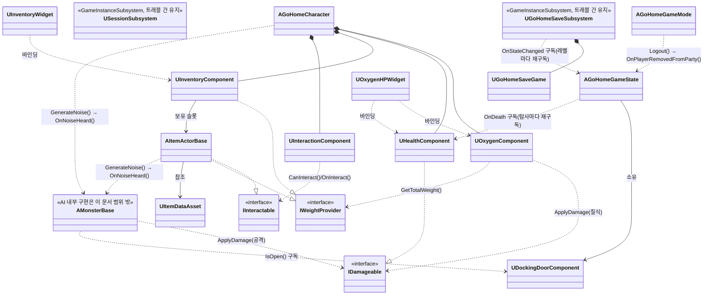

# GoHome 기술 아키텍처 (개발용)

> 이 문서는 개발자용 문서군(`Docs/Dev/`)이다. 링크 검증은 아래 "Docs/Design 참조 점검 체크리스트" 절 참고.
>
> 이 문서의 역할은 [../Design/02_GoHome_기술분석서.md](../Design/02_GoHome_기술분석서.md)에 이미 확정된 시스템 스펙을 실제 `Source/GoHome/` 폴더·클래스 이름에 매핑하고, 그 클래스들이 서로 어떤 관계·인터페이스로 맞물리는지 확정하는 것이다. **인일/복잡도/담당자 수치는 이 문서에 옮겨 적지 않는다** — 유일한 출처는 02문서이므로 필요하면 그쪽을 열어서 확인할 것. 반대로 **클래스 관계·경계 인터페이스 시그니처(아래 "시스템별 클래스 관계", "시스템 간 인터페이스 계약" 두 절)는 이 문서가 유일한 출처**다 — 02문서에는 시그니처 수준 내용이 없다.
>
> AI(`Source/GoHome/AI/`)의 내부 구현(상태 머신, 조향 로직 등)은 팀원 작업에 따라 바뀔 수 있으므로 이 문서에서 다루지 않는다. AI는 다른 시스템과 맞닿는 **경계 인터페이스**(데미지 전달, 소음 감지, 도킹 문 상태 구독)만 이 문서에서 고정한다 — 이 경계만 지키면 AI 내부 구현이 바뀌어도 다른 시스템은 영향받지 않는다.

## 목차

- [Docs/Design 참조 점검 체크리스트](#docsdesign-참조-점검-체크리스트)
- [모듈/폴더 구조](#모듈폴더-구조)
- [시스템 → 클래스 매핑](#시스템--클래스-매핑)
- [시스템별 클래스 관계](#시스템별-클래스-관계)
- [시스템 간 인터페이스 계약](#시스템-간-인터페이스-계약)
- [병렬 착수를 위한 헤더 스텁과 소유권](#병렬-착수를-위한-헤더-스텁과-소유권)
- [클래스 다이어그램](#클래스-다이어그램)
- [의존성/착수 순서](#의존성착수-순서)
- [2차 프로토타입 추가 시스템 배치](#2차-프로토타입-추가-시스템-배치)
- [Replication 권한 원칙](#replication-권한-원칙)

## Docs/Design 참조 점검 체크리스트

스크립트 동작 방식은 저장소 루트 [CLAUDE.md 검증 스크립트](../../CLAUDE.md#validation-script) 절 참고. 스크립트가 못 잡는 부분(본문 텍스트로만 언급된 절 번호)이 있으니, `Docs/Design/01`·`02`문서의 절 번호나 헤더 제목을 바꿀 때마다 아래를 추가로 확인한다:

1. `grep -rn "Design/0" Docs/Dev/` 로 이 문서군에서 Design 문서를 참조하는 모든 줄을 찾아, 절 번호가 **본문 텍스트로만**(링크가 아닌 형태로) 언급된 곳이 있는지 확인한다.
2. 헤더 번호(예: "10. 착수 순서", "13-1. ...")가 바뀌었다면, 이 문서의 "의존성/착수 순서"·"2차 프로토타입 추가 시스템 배치" 절에서 같은 번호를 인용한 곳도 함께 갱신한다.

## 모듈/폴더 구조

`Source/GoHome/` 하위는 02문서가 이미 확정한 기능별 분리 규칙(`Player`/`Interaction`/`AI`/`Item`/`UI`/`Save`)을 그대로 따르되, 02문서에 없던 `Core/` 폴더를 이 문서에서 신설한다 (GameState 상태 머신·세션/로비 흐름은 특정 아이템/AI 계열이 아니라 게임 흐름 자체를 다루므로 별도 폴더가 필요했음 — **이 결정의 유일한 출처는 이 문서**).

| 폴더 | 대응 시스템 (02문서 번호) | 의존 인터페이스 | 비고 |
|---|---|---|---|
| `Core/` | 1. 온라인 서브시스템 + 보이스 (게임 흐름 부분) | - | GameState 상태 머신, 세션 생성/참가, 도킹 문 |
| `Player/` | 2. 이동 + 사운드, 3. 산소 + HP | `IWeightProvider` 구현 (정의는 Interaction) | 무브먼트, 산소/체력 컴포넌트 |
| `Interaction/` | 4. 상호작용/운반/납품 | `IInteractable`, `IWeightProvider` 정의 | 소켓 어태치 홀딩, 인벤토리 |
| `AI/` | 5. AI 몬스터 | - (자체 `GenerateNoise` 함수 호출) | `BP_Monster` 상태 머신 지원 C++ 클래스, `GenerateNoise` |
| `Item/` | 4. 상호작용/운반/납품 (아이템 정의) | `IInteractable` 구현 | 아이템 액터 + 데이터 애셋 |
| `UI/` | 6. UI | - (각 시스템 리플리케이티드 프로퍼티 바인딩 대상) | UMG 바인딩용 C++ 베이스 클래스 |
| `Save/` | 9. 세이브 데이터 스키마, 8. 장비 강화 | - | `SaveGame` 오브젝트 |

`Public/`·`Private/` 최상위 배치 규칙은 [CODING_CONVENTIONS.md 폴더 규칙](CODING_CONVENTIONS.md#폴더-규칙) 참고.

## 시스템 → 클래스 매핑

이름은 02문서에 이미 등장한 것을 그대로 쓴다 (새 이름을 여기서 만들지 않음). 폴더 대응은 위 "모듈/폴더 구조" 표 참고. 각 블록의 `classes`는 `클래스명: 설명` 형태다.

### Core — 온라인 서브시스템 + 게임 흐름
```yaml
design_ref: ../Design/02_GoHome_기술분석서.md#1-온라인-서브시스템--보이스
classes:
  USessionSubsystem: "UGameInstanceSubsystem 파생. OnlineSubsystemSteam 기반 세션 생성/검색/참가/파괴 (리슨 서버, 호스트가 서버 겸임). 트래블(ServerTravel \"?listen\"/ClientTravel)은 호출 측(UI/GameInstance) 책임"
  GameState 상태 머신: 로비 → 탐사 지역 선택 → 출발 → 탐사 → 복귀 → 정산
  도킹 문 개폐 컴포넌트: 서버 권위, 리플리케이트. 2차 프로토타입 UMultiActorGateComponent(13-1)와 기반 공유 가능성을 염두에 두고 설계
  AGoHomeGameMode: 접속 종료(Logout) 처리 (신설, 아래 "시스템별 클래스 관계" 참고)
```

### Player — 이동/사운드/산소/HP
```yaml
design_refs:
  - ../Design/02_GoHome_기술분석서.md#2-이동--사운드
  - ../Design/02_GoHome_기술분석서.md#3-산소--hp
classes:
  무브먼트 확장: CharacterMovementComponent 확장 또는 부력 기반 커스텀 무브먼트 (서버 권위 + 클라 보간)
  UOxygenComponent: 액터 컴포넌트
  UHealthComponent: 액터 컴포넌트
notes:
  - IWeightProvider 인터페이스 구현 지점 (무게 참조는 Interaction 쪽 정의를 따름)
```

### Interaction — 상호작용/운반/납품
```yaml
design_ref: ../Design/02_GoHome_기술분석서.md#4-상호작용-운반-납품
classes:
  IInteractable: 인터페이스, 서버 RPC 소유권 이전
  소켓 어태치 홀딩: 오른손 소켓 (손전등만 왼손 예외)
  인벤토리: 4슬롯, 슬롯별 개별 RepNotify
  IWeightProvider: 인터페이스 정의 위치 (Player의 산소 컴포넌트, 2차의 수류 구간이 여기를 참조)
```

### AI — 몬스터
```yaml
design_ref: ../Design/02_GoHome_기술분석서.md#5-ai-몬스터
classes:
  BP_Monster: Enum 상태 머신(Patrol/Investigate/Chase/Attack/Return) + Steering Behaviors(Seek/Arrive/Pursuit/Avoidance)
  GenerateNoise: 함수(위치/반경/타입/발생원) — AI Perception 대신 자체 구현
notes:
  - 1차 투입 종: 청각 추적자 1종
```

### Item — 아이템 정의
```yaml
design_ref: ../Design/02_GoHome_기술분석서.md#4-상호작용-운반-납품
classes:
  아이템 액터 + 데이터 애셋: 무게/가치/파손 플래그/소음 플래그 조합으로 종 구분
```

### UI
```yaml
design_ref: ../Design/02_GoHome_기술분석서.md#6-ui
classes:
  UMG 바인딩용 C++ 베이스 클래스: 각 시스템의 리플리케이티드 프로퍼티 바인딩 (산소/HP 게이지, 인벤토리, 납품, 탐사 지역 선택, 로딩 연출, 제한 시간 카운트다운, 장비 강화 구매)
```

### Save — 세이브 데이터 / 장비 강화
```yaml
design_refs:
  - ../Design/02_GoHome_기술분석서.md#8-장비-강화-시스템
  - ../Design/02_GoHome_기술분석서.md#9-세이브-데이터-스키마
classes:
  SaveGame 오브젝트: 호스트 로컬, 파티 공유 재화/구매 완료 업그레이드 목록/마지막 진행 지점
notes:
  - 장비 강화 요청은 서버가 FIFO로 처리
```

## 시스템별 클래스 관계

각 폴더에서 실제로 생길 클래스와 그 관계를 "가상으로 코드를 짠다"는 수준으로 정리한다. 내부 구현(함수 바디, 알고리즘)은 다루지 않고, **클래스 간 소유/참조 관계·결합도를 끊어야 할 지점·구현 전에 결정해야 하는 숨은 요소**만 다룬다. `decisions`의 각 항목 중 02문서에 없던 내용을 이 문서에서 새로 정한 것은 그렇게 표시한다.

### Core
```yaml
classes:
  AGoHomeGameState: 상태 필드 + 전이 함수
  UDockingDoorComponent: 액터 부착, 서버 권위 개폐 상태
  AGoHomeGameMode: 접속 종료 처리
  USessionSubsystem: UGameInstanceSubsystem, Steam 세션 생성/검색/참가/파괴

relations:
  - 도킹 문 상태는 GameState가 직접 들고 있지 않고 UDockingDoorComponent가 별도로 소유한다 — GameState는 탐사 진행 단계(로비/탐사/정산 등)만 책임진다.

decoupling:
  - AI가 도킹 문 상태를 읽을 때 GameState 전체를 참조하지 않고 UDockingDoorComponent의 공개 상태(IsOpen(), 상태 변경 델리게이트)만 구독한다 — AI가 게임 흐름 전체와 결합되지 않도록.

decisions:
  - name: 세션 생명주기
    detail: USessionSubsystem은 UGameInstanceSubsystem(트래블 간 유지). UI는 BP 델리게이트만 구독, GameState는 세션 트리거로 쓰지 않음.
  - name: 상태 전이 트리거 (02문서에 없어 이 문서에서 확정)
    detail: |
      - 로비 → 탐사 지역 선택: Server_ConfirmZoneSelection()
      - 탐사 지역 선택 → 출발: 전원 replicated bool bReady == true 시 자동 전이 (Server_SetReady() 내에서 즉시 검사, 폴링 없음)
      - 탐사 → 복귀/정산: 도킹 문 닫힘 + 생존자 전원 잠수정 콜리전 볼륨 내부
      - 탐사 → 실패: 제한 시간 만료 또는 도킹 문 위협 판정(→ AI 경계 참고)
```

### Player
```yaml
classes:
  AGoHomeCharacter: ""
  UOxygenComponent: ""
  UHealthComponent: ""
  무브먼트 확장: CharacterMovementComponent 파생 또는 커스텀

relations:
  - AGoHomeCharacter가 Oxygen/Health 컴포넌트를 소유.
  - "UOxygenComponent는 소모 속도 계산 시 Interaction의 IWeightProvider를 참조하되, UInventoryComponent를 직접 참조하지 않고 인터페이스로만 접근한다."

decoupling:
  - "UHealthComponent는 \"누가 데미지를 주는지\" 몰라야 한다 → IDamageable(아래 인터페이스 계약 참고)로 노출해 호출자가 Character 타입을 몰라도 되게 한다."

decisions:
  - name: HP 0 처리
    detail: UHealthComponent가 서버 전용 OnDeath 브로드캐스트. GameState가 탐사마다 각 Character의 OnDeath에 재구독해 생존자 수 추적, 0명이면 Fail(EFailReason::AllPlayersDead).
  - name: 산소 0 → 데미지 경로
    detail: UOxygenComponent가 산소 0시 매 틱 IDamageable::ApplyDamage(질식 데미지, Owner, "Suffocation") 동기 호출.
  - name: 중복 사망 방지
    detail: UHealthComponent는 bIsDead 플래그로 사망 후 ApplyDamage를 no-op 처리(OnDeath 캐릭터당 탐사 1회 보장).
  - name: 접속 종료 처리
    detail: AGoHomeGameMode::Logout도 GameState::OnPlayerRemovedFromParty(APlayerState*)를 호출(OnDeath와 동일 경로 합류, TSet으로 멱등 보장).
```

### Interaction
```yaml
classes:
  UInventoryComponent: 4슬롯
  UInteractionComponent: 상호작용 대상 탐지
  IInteractable: ""
  IWeightProvider: ""
  소켓 어태치 헬퍼: ""

relations:
  - UInventoryComponent가 IWeightProvider를 구현(보유 아이템 무게 합산).
  - IInteractable은 Item이 구현.
  - 소켓 어태치는 Player의 스켈레탈 메시 소켓에 접근해야 하므로 두 폴더 사이의 결합 지점이다.

decoupling:
  - "소켓 어태치 헬퍼는 Interaction에 두되, Character는 \"오른손/왼손 소켓 이름\"만 공개 프로퍼티로 노출해 Interaction이 Character 내부 구조를 몰라도 되게 한다."

decisions:
  - name: 동시 픽업 레이스 컨디션
    detail: 아이템 액터의 서버 전용 bIsBeingClaimed 플래그로 Server_RequestPickup 중복 요청 거부(체크+설정은 한 동기 함수 안에서 처리, Latent/비동기 트레이스 금지).
  - name: 정산 값 전달
    detail: Interaction이 GameState->AddDeliveredValue(int32)를 직접 호출(델리게이트로 감싸지 않음).
  - name: 상호작용 대상 탐지 방식
    detail: 02문서에 감지 방식이 명시돼 있지 않아 이 문서에서 신설. UInteractionComponent가 카메라 정면 라인 트레이스(기본 TraceDistance 200, TraceInterval 0.1초 스로틀)로 IInteractable 구현 액터를 탐지하고, 로컬 컨트롤 폰에서만 동작한다(다른 클라이언트의 리플리케이트된 폰까지 트레이스하지 않도록 IsLocallyControlled()로 필터링). 대상이 바뀔 때만 OnInteractableTargetChanged를 브로드캐스트(HUD 프롬프트 바인딩용).
  - name: TryInteract() 서버 권위 (임시 상태, 주의)
    detail: 현재 TryInteract()는 CanInteract 확인 후 OnInteract를 로컬에서 직접 호출한다. AItemActorBase::OnInteract가 아직 빈 스텁이라 지금은 문제없지만, 실제 픽업 로직이 들어가면 클라이언트가 서버 승인 없이 상태를 바꾸는 셈이 되어 위 "동시 픽업 레이스 컨디션" 결정과 충돌한다 — 픽업 로직 구현 시 Server_RequestInteract 같은 서버 RPC 경유로 교체해야 한다(코드에 TODO로 표시돼 있음).
```

### AI (경계만)
```yaml
note: 내부 상태 머신·조향 로직은 팀원 구현에 맡기며 이 문서에서 다루지 않는다.

boundary_interfaces:
  - 공격 시 대상의 IDamageable::ApplyDamage를 호출 — 몬스터는 대상이 Player인지 몰라도 된다.
  - 소음 감지는 발생원이 호출하는 GenerateNoise가 대신 처리 — AI는 발생원이 Player인지 Item인지 몰라도 된다.
  - 도킹 문 위협 판정은 UDockingDoorComponent의 공개 상태만 읽는다.

decisions:
  - name: GenerateNoise 호출 방식 (02문서 5절 근거)
    detail: GenerateNoise는 동기 함수로 반경 내 각 몬스터의 IMonsterNoiseListener::OnNoiseHeard를 호출까지만 책임진다. 전이 로직은 각 몬스터의 내부 구현(경계 밖)이 정한다.
```

### Item
```yaml
classes:
  AItemActorBase: IInteractable + IWeightProvider(자기 자신의 무게 반환) 구현
  UItemDataAsset: 무게/가치/파손 플래그/소음 플래그

relations:
  - AItemActorBase가 IInteractable과 IWeightProvider를 구현. 종별 값은 데이터 애셋 참조로 결정.

decisions:
  - name: 타이머/충돌 감지 소유
    detail: 파손형의 충돌 속도 감지, 소음 유발형의 "30초 보유마다 +200" 누적 타이머는 아이템 액터 자신이 소유(인벤토리는 무게/개수만 앎).
```

### UI
```yaml
classes:
  위젯 목록: 산소/HP 게이지, 인벤토리, 납품, 탐사 지역 선택, 로딩 연출, 제한 시간 카운트다운, 장비 강화 구매

relations:
  - >
    표시 전용 위젯(게이지·인벤토리·카운트다운 등)은 리플리케이티드 프로퍼티/델리게이트를 구독만 한다.
    입력을 발생시키는 위젯(탐사 지역 선택 확정, 장비 강화 구매)은 서버 RPC(Server_ConfirmZoneSelection 등)만
    호출하고 로컬 상태를 직접 바꾸지 않는다 — 두 경우 모두 UI가 다른 시스템의 상태를 직접 쓰지 않는다는
    원칙은 유지된다.

hidden_elements: 없음(순수 바인딩 + 서버 RPC 호출)
```

### Save
```yaml
classes:
  UGoHomeSaveGame: 파티 공유 재화, 업그레이드 목록, 마지막 진행 지점
  UGoHomeSaveSubsystem: UGameInstanceSubsystem, UGoHomeSaveGame 소유 + 저장 트리거 로직

relations:
  - UGoHomeSaveSubsystem이 GameState의 상태 변경을 구독해 로비 복귀 시점 값을 UGoHomeSaveGame에 반영한다.
  - 8번 장비 강화 시스템이 Save의 업그레이드 목록을 읽고 쓴다.

decisions:
  - name: 저장 트리거
    detail: UGoHomeSaveSubsystem이 FOnExpeditionStateChanged를 구독, NewState == ELobby일 때 저장 수행(Core는 Save 존재를 모름).
  - name: 레벨 이동 간 구독 유지
    detail: UGoHomeSaveSubsystem(UGameInstanceSubsystem, 트래블 간 유지)이 소유하고, 매 레벨의 새 AGoHomeGameState::BeginPlay에서 재구독.
  - name: 로비 맵 재진입 시 저장 누락 방지
    detail: 구독 직후 GameState 현재 상태를 동기 확인해 이미 ELobby면 즉시 저장(델리게이트 엣지 트리거에만 의존하지 않음).
```

## 시스템 간 인터페이스 계약

시스템 경계를 넘는 접점만 모은 표. 서버/클라 권한 표시가 없는 항목은 서버 전용이다. "신설 제안" 표시는 02문서에 없는 이 문서의 새 결정이다.

| 접점 | 정의 위치 | 시그니처(초안) | 호출·구독 측 | 근거 |
|---|---|---|---|---|
| `IWeightProvider` | Interaction | `float GetTotalWeight() const` | Player(산소 소모 계산), 13-3 수류 구간, 8번 장비 강화(페널티 곡선 파라미터) | 02문서 3·4·8·13-3절 |
| `IInteractable` | Interaction | `bool CanInteract(APawn*) const` / `void OnInteract(APawn*)` | Item이 구현, 13-1 게이트의 두 트리거가 각각 구현, `UInteractionComponent`(Interaction)가 트레이스로 찾은 대상에 호출 | 02문서 4·13-1절 |
| `IDamageable` (신설 제안) | Player | `void ApplyDamage(float Amount, AActor* Instigator, FName DamageType)` | Player(HealthComponent)가 구현, AI(몬스터 공격)와 Player 자신(`UOxygenComponent`의 질식 데미지)이 소비 | 02문서에 데미지 전달 경로가 없어 이 문서에서 신설 |
| `GenerateNoise` | AI | `static void GenerateNoise(FVector Location, float Radius, ENoiseType Type, AActor* Source)` | Player(이동 사운드)·Item(소음 유발형)이 발생원(호출 즉시 동기 처리, 위 "AI (경계만)" 참고) | 02문서 2·4·5절 |
| `IMonsterNoiseListener` (신설 제안) | AI | `void OnNoiseHeard(FVector Location, float Radius, ENoiseType Type, AActor* Source)` | `AMonsterBase`가 구현, `GenerateNoise`가 반경 내 각 몬스터에 호출(반응 로직은 구현체 내부, 경계 밖) | 위 "AI (경계만)" `GenerateNoise` 호출 방식 정정 참고 |
| GameState 상태 델리게이트 | Core | `FOnExpeditionStateChanged(EExpeditionState NewState)` | UI(바인딩), `UGoHomeSaveSubsystem`(진행 지점 저장), Interaction(정산 시점 갱신) | 02문서 1·6·9절 |
| 도킹 문 상태 | Core | `bool IsOpen() const` / `FOnDoorStateChanged(bool bOpen)` | AI(위협 판정 구독), 13-1 게이트(기반 재사용 후보) | 02문서 1·13-1절 |
| 인벤토리 슬롯 | Interaction | `UPROPERTY(ReplicatedUsing=OnRep_Slot) FInventorySlot Slots[4]` | UI(슬롯별 바인딩) | 02문서 4·6절 |
| `OnDeath` (신설 제안) | Player | `FOnDeath OnDeath` (서버 전용 브로드캐스트, `DECLARE_MULTICAST_DELEGATE`) | Core(GameState 생존자 수 추적, 탐사마다 재구독) | 위 "Player" 절 HP 0 처리 결정 참고 |
| `GetCurrentValue()` (신설 제안) | Item | `float GetCurrentValue() const` (`AItemActorBase` 멤버) | Interaction(납품 시 `ItemData->Value` 대신 이 값을 `GameState->AddDeliveredValue()`에 전달) | 위 "Item" 절 파손형 결정 참고 — `ItemData->Value`는 애셋 공유값이라 인스턴스별 파손 반영 불가, 그래서 신설 |
| 정산/납품 값 흐름 | Interaction → Core → Save | `GameState->AddDeliveredValue(int32 Value)`(신설 제안 시그니처) | Interaction(딜리버리 존 진입 시 호출), Save(스키마 반영) | 02문서 4·9·13-2절 |

## 병렬 착수를 위한 헤더 스텁과 소유권

각자 선수 협의 없이 동시에 착수하려면, 아래 헤더들이 **Day 1에 먼저 커밋**되어 있어야 다른 폴더가 이를 include해 컴파일 참조를 시작할 수 있다. 이 표가 그 최소 스텁 목록이다.

시그니처 자체는 대부분 위 "시스템 간 인터페이스 계약" 표에 이미 있으므로, 아래 표는 파일 경로와 착수 이유만 다루고 시그니처가 겹치는 항목은 참고 표시로 대신한다.

| 헤더 경로 | 소유 폴더 | 담아야 할 최소 선언 | 다른 폴더가 착수 전 필요한 이유 |
|---|---|---|---|
| `Public/Interaction/IWeightProvider.h` | Interaction | (위 인터페이스 계약 표 `IWeightProvider` 참고) 순수 가상 함수만 | Player(산소), 13-3 수류 구간, 8번 장비 강화가 이 타입으로 참조 시작 |
| `Public/Interaction/IInteractable.h` | Interaction | (위 인터페이스 계약 표 `IInteractable` 참고) 순수 가상 함수만 | Item이 이 인터페이스를 구현하며 착수 |
| `Public/Interaction/FInventorySlot.h` | Interaction | 슬롯 구조체 필드(아이템 참조, 수량 등) | UI가 슬롯 바인딩 레이아웃을 먼저 잡을 수 있음 |
| `Public/Player/IDamageable.h` | Player | (위 인터페이스 계약 표 `IDamageable` 참고) 순수 가상 함수만 | AI가 공격 로직을 이 인터페이스 대상으로 작성 시작 |
| `Public/AI/ENoiseType.h` | AI | `ENoiseType`(Small/Medium/Large/Alarm) enum (`GenerateNoise` 시그니처는 위 인터페이스 계약 표 참고) | Player(이동 사운드)·Item(소음 유발형)이 발생원 호출 코드를 먼저 작성 |
| `Public/Core/EExpeditionState.h` | Core | `EExpeditionState` enum (델리게이트 시그니처는 위 인터페이스 계약 표 참고) | UI·Save·Interaction이 상태 구독 코드를 먼저 작성 |
| `Public/Core/EFailReason.h` | Core | `EFailReason` enum(`AllPlayersDead`, `TimeExpired`, `DockThreatened` 등) | Player(HealthComponent)와 UI가 실패 처리 코드를 먼저 작성 |
| `Public/Core/UDockingDoorComponent.h` | Core | (위 인터페이스 계약 표 "도킹 문 상태" 참고) 선언만 (구현 없음) | AI(도킹 문 위협 판정), 13-1 게이트가 이 타입으로 참조 시작 |
| `Public/Core/AGoHomeGameState.h` | Core | `AddDeliveredValue(int32)`, `Fail(EFailReason)`, `FOnExpeditionStateChanged OnStateChanged` 선언만 (구현 없음) | Interaction(정산 값 전달), UI, Save가 이 타입으로 참조 시작 |
| `Public/Player/UHealthComponent.h` | Player | (위 인터페이스 계약 표 `OnDeath` 참고) 선언만 (구현 없음) | Core(GameState)가 생존자 수 추적을 위해 이 델리게이트를 구독하며 착수 |

**열거형 값 (확정)**:
- `EExpeditionState`: `Lobby`, `ZoneSelect`, `Departure`, `Exploration`, `Return`, `Settlement`, `Failed`
- `ENoiseType`(02문서 5절 반경값 그대로): `Small`(300~500), `Medium`(800~1200), `Large`(1500~2000), `Alarm`(2500~3000)
- `EFailReason`: `AllPlayersDead`, `TimeExpired`, `DockThreatened`

**소유권 규칙**: 각 헤더는 소유 폴더 담당자만 수정한다. 다른 폴더는 include해서 인터페이스/타입만 소비하며, 필드 추가나 시그니처 변경이 필요하면 소유자 리뷰를 거친다. `AGoHomeGameState`처럼 여러 폴더가 값을 쓰는 공유 클래스는 **필드 선언은 Core만** 하고, 다른 폴더는 반드시 퍼블릭 서버 함수(`AddDeliveredValue` 등)로만 값을 바꾼다 — 이렇게 하면 `GameState.h`를 여러 사람이 동시에 손대며 생기는 병합 충돌을 피할 수 있다.

## 클래스 다이어그램

필드·메서드 목록은 위 "시스템별 클래스 관계"·"시스템 간 인터페이스 계약" 절에 이미 있으므로, 여기서는 텍스트로 보기 어려운 교차 폴더 의존 관계만 화살표로 표시한다.



## 의존성/착수 순서

> 아래는 [02문서 10절](../Design/02_GoHome_기술분석서.md#10-착수-순서) 표를 코드 폴더 단위로 환산한 것이다. 시스템 번호→폴더 대응은 위 "모듈/폴더 구조" 표를 따른다. 순서를 정한 이유(왜 먼저/나중인지)는 여기 옮겨 적지 않으며, 근거는 전부 02문서 10절에 있다.

```
Player/ (2. 이동)                          ─ 최우선 착수, 크리티컬 패스
   │
   ├──▶ Core/ (1. 온라인 서브시스템)         ─ 최소 기능은 병행 가능
   ├──▶ Player/ (3. 산소+HP)                 ─ Interaction의 IWeightProvider 스텁 합의 후
   └──▶ Interaction/ (4. 상호작용/운반/납품)

AI/ (5. AI 몬스터)                          ─ 2번 완료 대기 없이 즉시 착수 가능

Core/ + Player/ + Interaction/ ──▶ UI/ (6. UI)

Core/ (1. 도킹 문 배치 협의) ──▶ (7. 레벨 — 코드 폴더 없음, 그레이박스 작업)

Save/ (9. 세이브 스키마) ──▶ Save/ (8. 장비 강화)
   ▲                             ▲
   └── Interaction/(4, 정산 로직 안정) · Core/(1, 로비 구조 안정)
```

7번(레벨/그레이박스)은 `Source/GoHome/` 코드 폴더가 아니라 레벨 애셋 작업이므로 위 트리에 폴더로 넣지 않았다.

## 2차 프로토타입 추가 시스템 배치

[../Design/02_GoHome_기술분석서.md 13. 2차 프로토타입 추가 시스템](../Design/02_GoHome_기술분석서.md#13-2차-프로토타입-추가-시스템) 참고. 폴더 배치는:

- 13-1 동시 트리거 게이트(`UMultiActorGateComponent`) → `Core/` (도킹 문 컴포넌트 확장). **동시 활성화 판정 (결정)**: `UMultiActorGateComponent`가 트리거별 서버 전용 `bool` 배열을 소유한다. 각 트리거(`IInteractable` 구현체)의 `OnInteract`는 `Server_SetTriggerActive(int32 Index, bool bActive)`를 공유 컴포넌트에 호출하고, 이 함수가 같은 호출 안에서 전원 활성 여부를 동기 검사해 게이트를 연다 — line 113 동시 픽업과 동일한 "단일 스레드 서버 틱" 논리가 여기도 적용된다.
- 13-2 목표 점수 시스템 → `Core/`(GameState 필드) + `Save/`(스키마) + `UI/`(표시)
- 13-3 수류 구간(`PhysicsVolume`) → `Player/`(이동 시스템과 통합) 또는 레벨 배치, `IWeightProvider` 참조

## Replication 권한 원칙

- 서버 권위: 도킹 문 상태, 이동/위치, 산소/HP, 아이템 소유권, 소음 이벤트, 정산/재화, 목표 점수
- 클라이언트: 단순 보간만 (이동), 입력 요청만 (상호작용/구매 — 서버 승인 후 반영)
